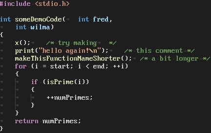

# Elastic Tabstops Lite for VS Code

## Features

Align by adjust spaces before tab.

## Extension Settings

This extension contributes the following settings:

* `elasticTabstopsLite.format.enable`: Enable/disable Elastic Tabstops Lite formatter.
